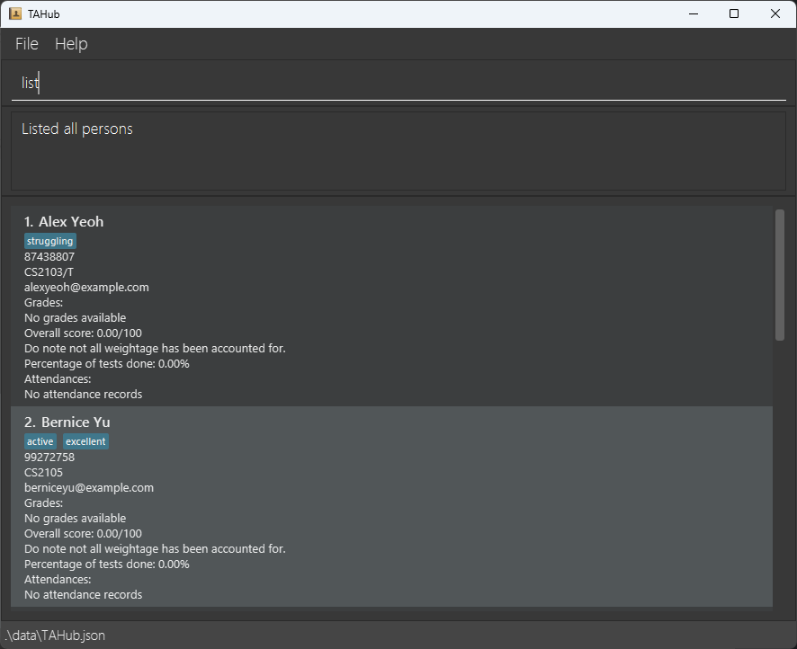
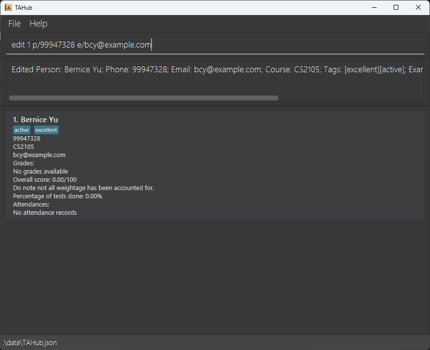
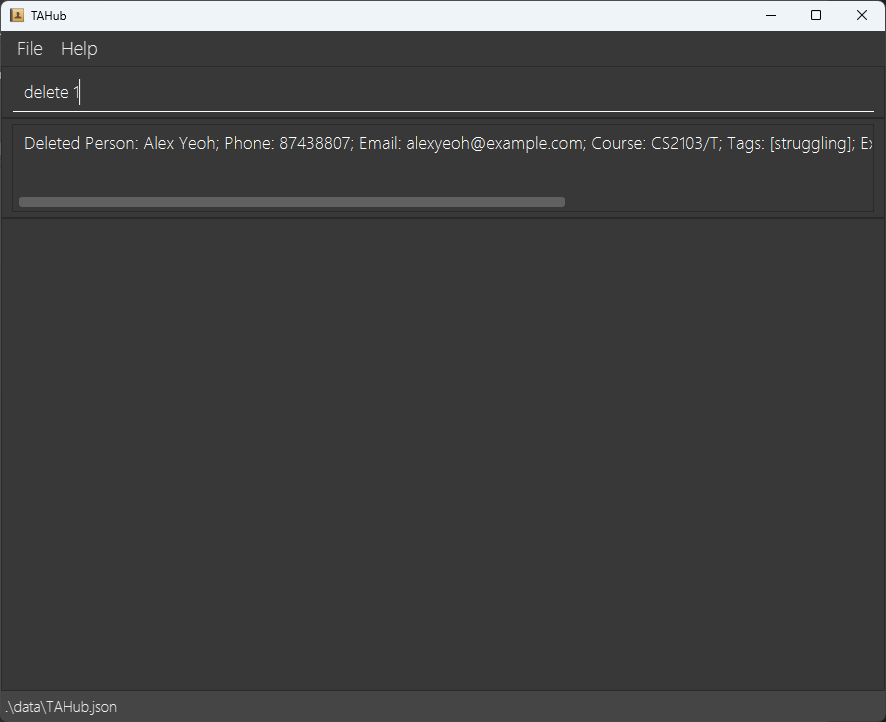
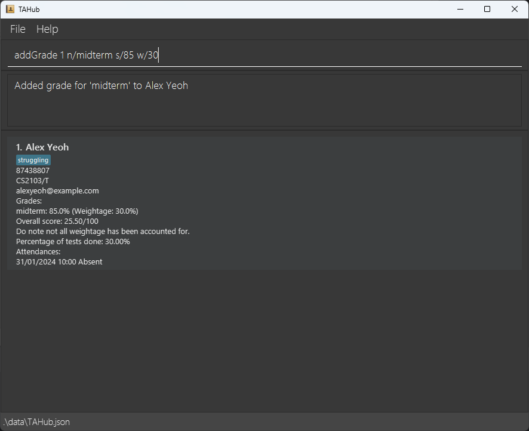
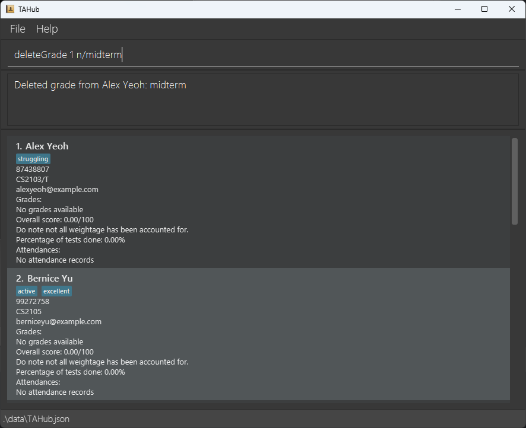
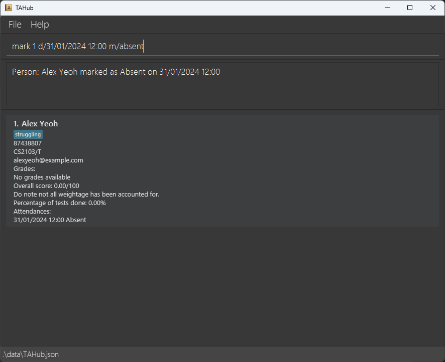
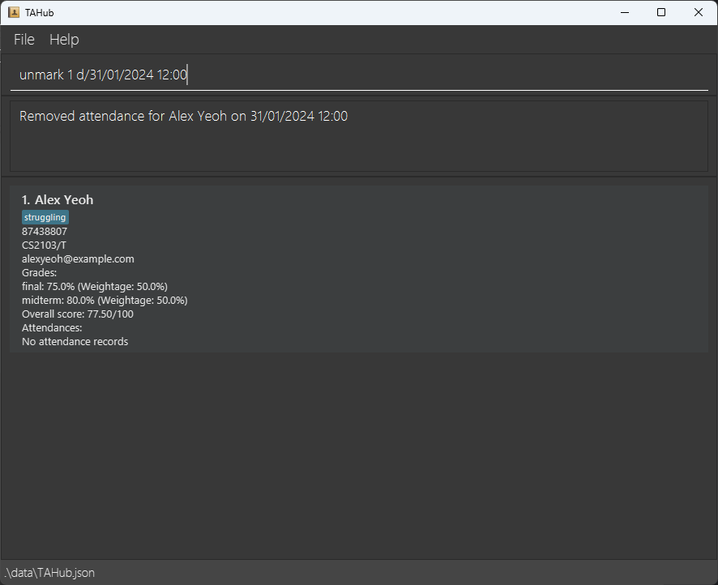
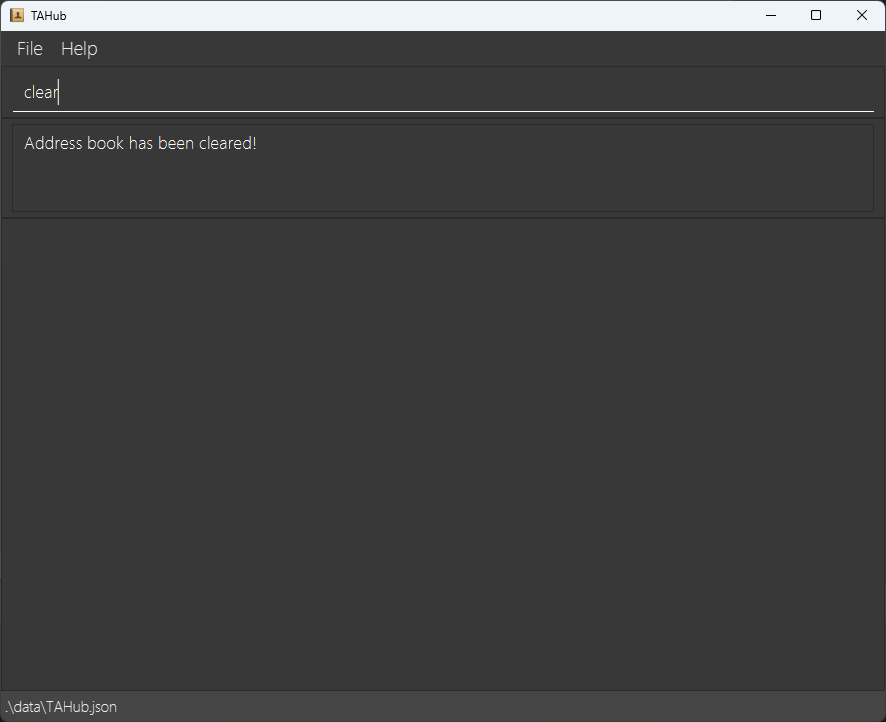

# TAHub User Guide

TAHub Level 3 (TAHub) is a **desktop app for managing contacts, optimized for use via a Line Interface** (CLI) while still having the benefits of a Graphical User Interface (GUI). If you can type fast, TAHub can get your contact management tasks done faster than traditional GUI apps.

This app is designed for Teaching Assistants (TAs) who are experienced with using the CLI and are comfortable with command-based interactions. However, if you're new to the CLI and still want to try TAHub, there’s a detailed **Quick Start** section to help you get started smoothly and become familiar with the commands.

<!-- * Table of Contents -->
<page-nav-print />

---
## Glossary

- **CLI**: Command Line Interface, where you type commands to interact with the application.
- **GUI**: Graphical User Interface, where you interact with the application through visual elements like buttons and windows.
- **Index**: The position of a person in the currently displayed list. For example, in a list of 5 contacts, the command `delete 3` would remove the third contact shown in that list.


## Quick start

1. Ensure you have Java `17` or above installed in your Computer.

1. Download the latest `.jar` file from [here](https://github.com/se-edu/TAHub-level3/releases).

1. Copy the file to the folder you want to use as the _home folder_ for your TAHub.

1. Open a command terminal, `cd` into the folder you put the jar file in, and use the `java -jar TAHub.jar` command to run the application.<br>
   A GUI similar to the below should appear in a few seconds.<br>
   

1. Type the command in the command box and press Enter to execute it. e.g. typing **`help`** and pressing Enter will open the help window.<br>
   Some example commands you can try:

   - `list` : Lists all contacts.

   - `add n/John Doe p/98765432 e/johnd@example.com c/CS2103/T` : Adds a contact named `John Doe` to the Address Book.

   - `delete 3` : Deletes the 3rd contact shown in the current list.

   - `clear` : Deletes all contacts.

   - `exit` : Exits the app.

1. Refer to the [Features](#features) below for details of each command.

---

## Quick Start (Detailed)

1. Ensure you have Java `17` or above installed in your Computer.

   - **Check if Java is installed:**

     1. Open your command terminal:
        - <span style="color: #1f77b4;"><strong>Windows:</strong></span>: Press `Windows + R`, type `cmd`, and hit Enter.
        - <span style="color: #ff7f0e;"><strong>Mac:</strong></span> Press `Command + Space`, type `Terminal`, and hit Enter.
        - <span style="color: #2ca02c;"><strong>Linux</strong></span>: Press `Ctrl + Alt + T`, or search for "Terminal" in your applications menu.
     2. Once the terminal is open, type the following command and press Enter:
        ```bash
        java -version
        ```
     3. If your system has Java `17` or above, you should see something like:
        ```bash
        java version "17.0.x" 2024-xx-xx LTS
        ```
     4. If your Java version is lower than `17`, proceed to the next step to install Java.

   - **Install Java `17` if not installed:**
     1. Go to [Oracle's Java 17 download page](https://www.oracle.com/java/technologies/javase-jdk17-downloads.html).
     2. Download and install the appropriate Java Development Kit (JDK) for your operating system by following the instructions provided.
     3. After installation, repeat the `java -version` command to ensure Java is properly installed.

2. Download the latest `.jar` file from [here](https://github.com/se-edu/TAHub-level3/releases).

   1. Visit the [GitHub releases page](https://github.com/se-edu/TAHub-level3/releases).
   2. Download the `.jar` file (for example, `TAHub.jar`) from the latest release.
   3. Save the `.jar` file to the folder where you want to store your TAHub project.

3. Copy the file to the folder you want to use as the _home folder_ for your TAHub.

   1. <span style="color: #1f77b4;"><strong>Windows</strong></span>:

      - Locate the downloaded `.jar` file in your `Downloads` folder.
      - Right-click on the `.jar` file, select Copy.
      - Navigate to the folder where you want to store the TAHub, right-click and select Paste.

   2. <span style="color: #ff7f0e;"><strong>Mac</strong></span>:

      - Open the **Finder** and go to your `Downloads` folder.
      - Right-click (or `Control + Click`) on the `.jar` file and choose Copy.
      - Go to the folder where you want to keep the file, then right-click and select Paste.

   3. <span style="color: #2ca02c;"><strong>Linux</strong></span>:
      - Open your file manager and go to your `Downloads` directory.
      - Right-click on the `.jar` file, choose Copy.
      - Go to the destination folder, right-click and select Paste.

4. Open a command terminal, `cd` into the folder where you saved the `.jar` file, and use the following command to run the application.

   1. <span style="color: #1f77b4;"><strong>Windows</strong></span>:

      - Open the folder where you saved the `.jar` file.
      - To get the full path of the folder:
        1. Right-click on the folder and select **Properties**.
        2. In the **General** tab, you will see the **Location** field. Copy the location path. (Alternatively, you can navigate to the folder, click on the address bar at the top, and copy the full folder path (e.g., `C:\Users\YourName\Documents\TAHub`))
      - Open the **Command Prompt**:
        - Press `Windows + R`, type `cmd`, and press Enter.
      - Use the `cd` command and paste the copied path to change to the directory where the `.jar` file is located. Example:
        ```bash
        cd C:\Users\YourName\Documents\TAHub
        ```
      - Run the app with:
        ```bash
        java -jar TAHub.jar
        ```

   2. <span style="color: #ff7f0e;"><strong>Mac</strong></span>/<span style="color: #2ca02c;"><strong>Linux</strong></span>:
      - Open the **Terminal** by searching for it or using `Ctrl + Alt + T`.
      - To get the full path of the folder where the `.jar` file is located:
        - Open **Finder** or **File Explorer**.
        - Navigate to the folder where you saved the `.jar` file.
        - Right-click on the folder and choose **Get Info** (Mac) or **Properties** (Linux) to see the full path, or press `Cmd + Option + C` (Mac) to copy the path.
      - Use the `cd` command and paste the copied path to change to the directory where the `.jar` file is located. Example:
        ```bash
        cd /Users/YourName/Documents/TAHub
        ```
      - Run the app with:
        ```bash
        java -jar TAHub.jar
        ```

   After a few seconds, the GUI similar to the one below should appear:
   

5. Type commands in the command box and press Enter to execute them. Some example commands you can try:

   - `list`: Lists all contacts.
   - `add n/John Doe p/98765432 e/johnd@example.com c/CS2103/T`: Adds a contact named `John Doe`.
   - `delete 3`: Deletes the 3rd contact shown in the current list.
   - `clear`: Deletes all contacts.
   - `exit`: Exits the app.

6. Refer to the [Features](#features) section below for details of each command.

---

## Features

<box type="info" seamless>

**Notes about the command format:**<br>

- Words in `UPPER_CASE` are the parameters to be supplied by the user.<br>
  e.g. in `add n/NAME`, `NAME` is a parameter which can be used as `add n/John Doe`.

- Items in square brackets are optional.<br>
  e.g `n/NAME [t/TAG]` can be used as `n/John Doe t/friend` or as `n/John Doe`.

- Items with `…`​ after them can be used multiple times including zero times.<br>
  e.g. `[t/TAG]…​` can be used as ` ` (i.e. 0 times), `t/friend`, `t/friend t/family` etc.

- Parameters can be in any order.<br>
  e.g. if the command specifies `n/NAME p/PHONE_NUMBER`, `p/PHONE_NUMBER n/NAME` is also acceptable.

- Extraneous parameters for commands that do not take in parameters (such as `help`, `list`, `exit` and `clear`) will be ignored.<br>
  e.g. if the command specifies `help 123`, it will be interpreted as `help`.

- If you are using a PDF version of this document, be careful when copying and pasting commands that span multiple lines as space characters surrounding line-breaks may be omitted when copied over to the application.
  </box>

### Viewing help : `help`

Shows a message explaining how to access the help page.

Format: `help`

Expected output:


### Adding a person: `add`

Adds a person to the address book.

Format: `add n/NAME p/PHONE_NUMBER e/EMAIL c/COURSE [t/TAG]…​`

Expected output:


<box type="tip" seamless>

**Tip:** A person can have any number of tags (including 0)
</box>

Examples:

- `add n/John Doe p/98765432 e/johnd@example.com c/CS2103/T, block 123, #01-01`
- `add n/Betsy Crowe t/friend e/betsycrowe@example.com c/CS1231S p/1234567 t/criminal`

### Listing all persons : `list`

Shows a list of all persons in the address book.

Format: `list`

Expected output:


### Editing a person : `edit`

Edits an existing person in the address book.

Format: `edit INDEX [n/NAME] [p/PHONE] [e/EMAIL] [c/COURSE] [t/TAG]…​`

- Edits the person at the specified `INDEX`. The index refers to the index number shown in the displayed person list. The index **must be a positive integer** 1, 2, 3, …​
- At least one of the optional fields must be provided.
- Existing values will be updated to the input values.
- When editing tags, the existing tags of the person will be removed i.e adding of tags is not cumulative.
- You can remove all the person’s tags by typing `t/` without
  specifying any tags after it.

Examples:

- `edit 1 p/91234567 e/johndoe@example.com` Edits the phone number and email address of the 1st person to be `91234567` and `johndoe@example.com` respectively.
- `edit 2 n/Betsy Crower t/` Edits the name of the 2nd person to be `Betsy Crower` and removes all tags associated with the person.

Expected output:


### Locating persons by name: `find`

Finds persons whose names contain any of the given keywords.

Format: `find KEYWORD [MORE_KEYWORDS]`

- The search is case-insensitive. e.g `hans` will match `Hans`
- The order of the keywords does not matter. e.g. `Hans Bo` will match `Bo Hans`
- Only the name is searched.
- Only full words will be matched e.g. `Han` will not match `Hans`
- Persons matching at least one keyword will be returned (i.e. `OR` search).
  e.g. `Hans Bo` will return `Hans Gruber`, `Bo Yang`

Examples:

- `find John` returns `john` and `John Doe`
- `find alex david` returns `Alex Yeoh`, `David Li`<br>

Expected output:


### Deleting a person : `delete`

Deletes the specified person from the address book.

Format: `delete INDEX`

- Deletes the person at the specified `INDEX`.
- The index refers to the index number shown in the displayed person list.
- The index **must be a positive integer** 1, 2, 3, …​

Examples:

- `list` followed by `delete 2` deletes the 2nd person in the address book.
- `find John` followed by `delete 1` deletes the 1st person in the results of the `find` command.

Expected output:


### Adding or editing a grade: `addGrade`

Adds or updates a grade for a person in the address book. If a grade with the same test name already exists, it will be overwritten.

Format: `addGrade INDEX n/TEST_NAME s/SCORE w/WEIGHTAGE`

- Adds or updates a grade for the person at the specified `INDEX`. The index refers to the index number shown in the displayed person list. The index **must be a positive integer** 1, 2, 3, …​
- `TEST_NAME` refers to the name of the test (e.g. Midterm Exam).
- `SCORE` refers to the score obtained by the person, which must be between 0 and 100.
- `WEIGHTAGE` refers to the weightage of the test in percentage, which must be greater than 0 and less than or equal to 100.
- If a grade with the same `TEST_NAME` exists, it will be updated with the new `SCORE` and `WEIGHTAGE`.

Examples:

- `addGrade 2 n/Midterm s/85 w/30` Adds or updates a grade for the 2nd person in the list with a score of 85% for a test named "Midterm" with a 30% weightage.
- `find Betsy` followed by `grade 1 n/FinalExam s/92 w/30` Adds or updates a grade for the 1st person in the results of the `find` command with a score of 92% for "FinalExam" and 30% weightage.

Expected output:


### Deleting a grade from a person: `deleteGrade`

Deletes a grade for a person in the address book.

Format: `deleteGrade INDEX n/TEST_NAME`

- Deletes the grade for the specified `TEST_NAME` for the person at the specified `INDEX`.
- The index refers to the index number shown in the displayed person list. The index **must be a positive integer** 1, 2, 3, …​
- `TEST_NAME` refers to the name of the test whose grade you want to delete.

Examples:

- `deleteGrade 2 n/Midterm` Deletes the grade for the "Midterm" test for the 2nd person in the list.
- `find Betsy` followed by `deleteGrade 1 n/FinalExam` Deletes the "FinalExam" grade for the 1st person in the results of the `find` command.

Expected output:


### Marking attendance: `mark`

Marks the attendance record for the specified date for a person in the address book. If the attendance record for that date already exists, it will be overwritten.

Format: `mark INDEX d/DATE_TIME m/ATTENDANCE`

- Adds or updates attendance for the person at the specified `INDEX`. The index refers to the index number shown in the displayed person list. The index **must be a positive integer** 1, 2, 3, …​
- `DATE_TIME` refers to the date and time of attendance that you want to add or edit. It must be written in the format `dd/MM/yyyy HH:mm`.
- `ATTENDANCE` refers to the attendance status, which must be either `Attended` or `Absent`. They are case-sensitive.
- If the attendance record for `DATE_TIME` already exists, it will be updated with the new `ATTENDANCE`.

Examples:

- `mark 2 d/31/01/2024 10:00 m/Attended` Sets the attendance to 'Attended' on the 10 AM of January 31st, 2024 for the 2nd person in the list.
- `find John` followed by `mark 1 d/31/01/2024 12:00 m/Absent` Sets the attendance to 'Absent' on the 12 PM of January 31st, 2024 for the 1st person in the results of the `find` command.

Expected output:


### Unmarking attendance: `unmark`

Deletes the attendance record for the specified date for a person in the address book. All the remaining attendance records for that person will be retained.

Format: `unmark INDEX d/DATETIME`

- Deletes attendance for the person at the specified `INDEX`. The index refers to the index number shown in the displayed person list. The index **must be a positive integer** 1, 2, 3, …​
- `DATE_TIME` refers to the date and time of attendance that you want to delete. It must be written in the format `dd/MM/yyyy HH:mm`.

Examples:

- `unmark 2 d/31/01/2024 10:00` Deletes the attendance on the 10 AM of January 31st, 2024 for the 2nd person in the list.
- `find John` followed by `unmark 1 d/31/01/2024 12:00` deletes the attendance on the 12 PM of January 31st, 2024 for the 1st person in the results of the `find` command.

Expected output:


### Clearing all entries : `clear`

Clears all entries from the address book.

Format: `clear`

Expected output:


### Exiting the program : `exit`

Exits the program and closes.

Format: `exit`

### Saving the data

TAHub data are saved in the hard disk automatically after any command that changes the data. There is no need to save manually.

### Editing the data file

TAHub data are saved automatically as a JSON file `[JAR file location]/data/TAHub.json`. Advanced users are welcome to update data directly by editing that data file.

<box type="warning" seamless>

**Caution:**
If your changes to the data file makes its format invalid, TAHub will discard all data and start with an empty data file at the next run. Hence, it is recommended to take a backup of the file before editing it.<br>
Furthermore, certain edits can cause the TAHub to behave in unexpected ways (e.g., if a value entered is outside the acceptable range). Therefore, edit the data file only if you are confident that you can update it correctly.
</box>

### Archiving data files `[coming in v2.0]`

_Details coming soon ..._

---

## FAQ

**Q**: How do I transfer my data to another computer?<br>
**A**: To transfer your TAHub data to another computer, follow these steps:

1. **Locate the Data File** on Your Current Computer:
    - Open the folder where TAHub saves its data. By default, the data file is located at `[JAR file location]/data/TAHub.json`.
    - If you installed TAHub in a custom folder, look for the `data` folder within that location.
    - Copy the `TAHub.json` file to a USB drive, cloud storage, or any other method you prefer for transferring files between computers.

2. **Install TAHub on the New Computer**:
    - Download the latest `.jar` file from the [TAHub releases page](https://github.com/se-edu/TAHub-level3/releases).
    - Place the `.jar` file in a folder on the new computer where you want to use TAHub.

3. **Run TAHub Once on the New Computer**:
    - Open a terminal, `cd` into the folder containing the `.jar` file, and run the command:
      ```bash
      java -jar TAHub.jar
      ```
    - This creates a new `data` folder in the same directory as the `.jar` file with an empty `TAHub.json` file.

4. **Replace the Empty Data File**:
    - Close the TAHub application on the new computer.
    - Go to the `data` folder where the new `TAHub.json` file was created.
    - Delete the empty `TAHub.json` file and replace it with the `TAHub.json` file you copied from the old computer.

5. **Verify the Data Transfer**:
    - Open TAHub on the new computer by running the `.jar` file again.
    - Check that all your contacts, grades, and attendance records appear correctly, verifying that the data has been successfully transferred.

---

By following these steps, you can easily transfer all your TAHub data to a new computer without losing any information.


---

## Known issues

1. **When using multiple screens**, if you move the application to a secondary screen, and later switch to using only the primary screen, the GUI will open off-screen. The remedy is to delete the `preferences.json` file created by the application before running the application again.
2. **If you minimize the Help Window** and then run the `help` command (or use the `Help` menu, or the keyboard shortcut `F1`) again, the original Help Window will remain minimized, and no new Help Window will appear. The remedy is to manually restore the minimized Help Window.

---

## Command Summary

### Person Commands

| Action      | Format, Examples                                                                                                                                    |
| ----------- |-----------------------------------------------------------------------------------------------------------------------------------------------------|
| **Add**     | `add n/NAME p/PHONE_NUMBER e/EMAIL c/COURSE [t/TAG]…​` <br> e.g., `add n/James Ho p/22224444 e/jamesho@example.com c/CS2103/T t/friend t/colleague` |
| **Clear**   | `clear`                                                                                                                                             |
| **Delete**  | `delete INDEX`<br> e.g., `delete 3`                                                                                                                 |
| **Edit**    | `edit INDEX [n/NAME] [p/PHONE_NUMBER] [e/EMAIL] [c/COURSE] [t/TAG]…​`<br> e.g.,`edit 2 n/James Lee e/jameslee@example.com`                          |
| **Find**    | `find KEYWORD [MORE_KEYWORDS]`<br> e.g., `find James Jake`                                                                                          |

### Grade Commands

| Action              | Format, Examples                                                                                                      |
| ------------------- | --------------------------------------------------------------------------------------------------------------------- |
| **Add/Edit Grade**  | `addGrade INDEX n/TEST_NAME s/SCORE w/WEIGHTAGE` <br> e.g., `addGrade 1 n/Midterm s/85 w/30`                          |
| **Delete Grade**    | `deleteGrade INDEX n/TEST_NAME` <br> e.g., `deleteGrade 1 n/Midterm`                                                 |

### Attendance Commands

| Action                | Format, Examples                                                                                                    |
| --------------------- | ------------------------------------------------------------------------------------------------------------------- |
| **Mark Attendance**   | `mark INDEX d/DATE_TIME m/ATTENDANCE` <br> e.g., `mark 1 d/31/01/2024 10:00 m/Attended`                            |
| **Unmark Attendance** | `unmark INDEX d/DATE_TIME` <br> e.g., `unmark 1 d/31/01/2024 10:00`                                                |

### General Commands

| Action          | Format                                                                                                                    |
| --------------- | ------------------------------------------------------------------------------------------------------------------------- |
| **List**        | `list`                                                                                                                    |
| **Help**        | `help`                                                                                                                    |
| **Exit**        | `exit`                                                                                                                    |

